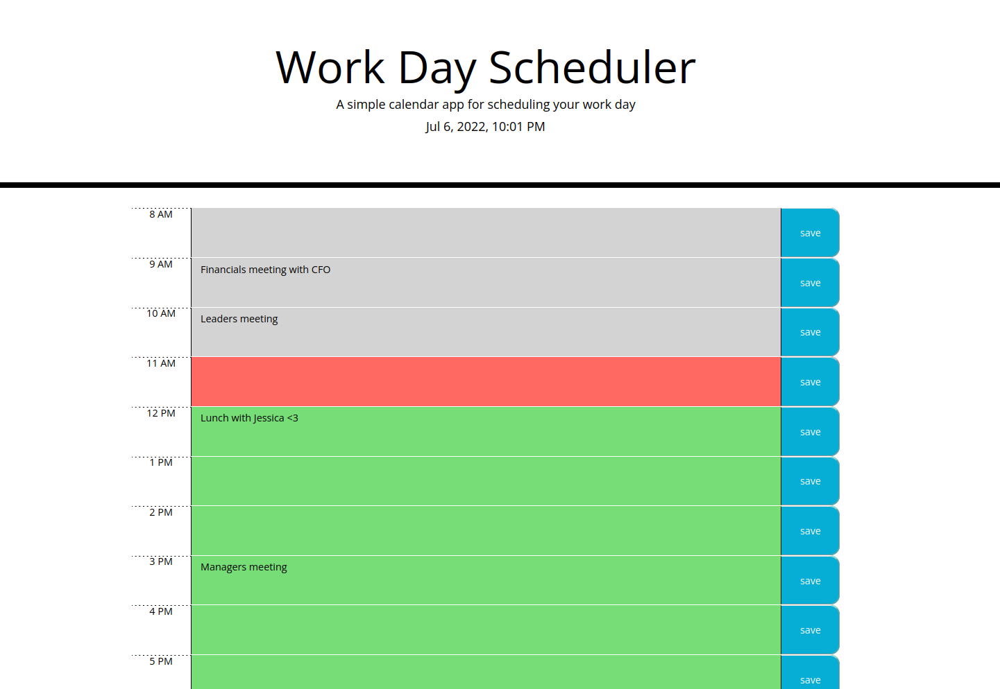

# Schedule Your Work!
This is a project to help humans adhere to a busy and productive schedule. It's a very clean dayplanner for all your hour by hour needs.

## About the project
This was mostly logically coded with javascript to manipulate hour blocks to plan out a day. The time grabbing is done through luxon, and most of the javascript was assisted with jQuery. The styling is from bootstrap mainly, with some fonts from Google.

## Project Criteria

- Assuming a user is using a daily planner to create a schedule
- When they open the planner
-   They are greeted by the current day at the top of the calendar
- When they scroll down
-   Then they are presented with time blocks for standard business hours
- When they view the time blocks for that day
-   Then each time block is color-coded to indicate whether it is in the past, present, or future
- When they click into a time block
-   Then they can enter details into an event
- When they click the save button for that time block
-   Then the text for that event is saved locally
- When they refresh the page
-   Then the saved events persist

## Screenshots!

## Deployment of project
You can access the site [here!](https://fixedotter.github.io/ScheduleYourWork/)